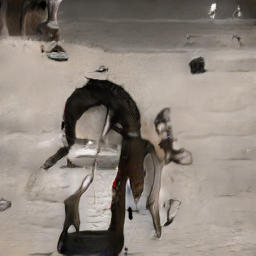
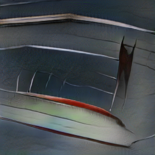
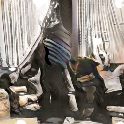
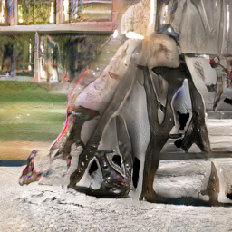
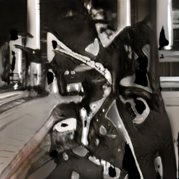

# StackGAN-Pytorch revision for Colab

This is StackGAN-Pytorch revised version for Google Colab.

Refer to [https://github.com/hanzhanggit/StackGAN-Pytorch](https://github.com/hanzhanggit/StackGAN-Pytorch) for original source version, 
it is implementation for the paper [StackGAN: Text to Photo-realistic Image Synthesis with Stacked Generative Adversarial Networks](https://arxiv.org/pdf/1612.03242v1.pdf).

Refer to troubleshooting [issues](https://github.com/rightlit/StackGAN-Pytorch-rev/issues) while running with original source 

### Dependencies
python == 3.6

pytorch == 1.2

Torch7 (http://torch.ch/docs/getting-started.html#_)

In addition, please add the project folder to PYTHONPATH and `pip install` the following packages:
- `torchfile`
- `tensorboardX == 1.1`
- `tensorboard==1.11.0`
- `torchvision==0.4.0`

**Data**

1. Download preprocessed char-CNN-RNN text embeddings for [training coco](https://drive.google.com/open?id=0B3y_msrWZaXLQXVzOENCY2E3TlU) and  [evaluating coco](https://drive.google.com/open?id=0B3y_msrWZaXLeEs5MTg0RC1fa0U), save them to `data/coco`.
  - [Optional] Follow the instructions [reedscot/icml2016](https://github.com/reedscot/icml2016) to download the pretrained char-CNN-RNN text encoders and extract text embeddings.
2. Download the [coco](http://cocodataset.org/#download) image data. Extract them to `data/coco/`.

**Evaluating**
- Run `python main.py --cfg cfg/coco_eval.yml --gpu 2` to generate samples from captions in COCO validation set.

Examples for COCO:
 

- This wire metal rack holds several pairs of shoes and sandals
- A dog sleeping on a show rack in the shoes.
- Various slides and other footwear rest in a metal basket outdoors.

- A small dog is curled up on top of the shoes
- a shoe rack with some shoes and a dog sleeping on them
- A motorcycle parked in a parking space next to another motorcycle.

- An old motorcycle parked beside other motorcycles with a brown leather seat.
- Motorcycle parked in the parking lot of asphalt.
- A close up view of a motorized bicycle, sitting in a rack. 

**References**

- Generative Adversarial Text-to-Image Synthesis [Paper](https://arxiv.org/abs/1605.05396) [Code](https://github.com/reedscot/icml2016)
- Learning Deep Representations of Fine-grained Visual Descriptions [Paper](https://arxiv.org/abs/1605.05395) [Code](https://github.com/reedscot/cvpr2016)
